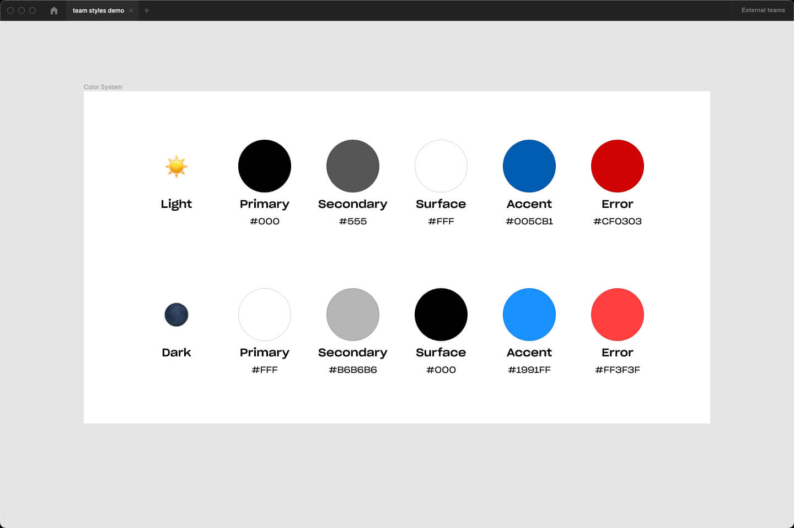

# [Dark Vader on Figma](https://www.figma.com/community/plugin/1000857171878658140/Dark-Vader-Beta-%F0%9F%96%A4%F0%9F%92%9B)

## How it works?

1. **Setup your colour system.**
Make sure you have them published.

2. **Select layers and use "👩‍💻 Setup" from Dark Vader menu.**
Make sure your published styles are used. Copy the color IDs into your own version of this AirTable [template]
[Template link](https://airtable.com/shrJ5fqeb5a3Nq3H6).

https://user-images.githubusercontent.com/3534296/139605163-21d2a0cd-b666-46ca-9980-5407ac5a3234.mp4

3. **After setting up AirTable copy the table link and paste it into "🖤 convert".**
Enjoy using Dark Vader. Just keep that link or bookmark it somewhere.

https://user-images.githubusercontent.com/3534296/139605167-ec608147-a3fe-4cf9-8162-fb1669ad39ae.mp4

## Give feedback or report an issue

1. Describe what happened in details.
2. Provide a link to your AirTable sheet.
3. Add a screenshot of the console error. Go to `Plugins > Development > Open console`

Create an issue here: [new issue](https://github.com/zeroxme/dark-vader-issues/issues/new)

---

### Dark Vader is a free plugin for the community. 

[☕️ Support me](https://bit.ly/3aNgF4Q)

Follow me on twitter [@zerox_me](https://twitter.com/zerox_me)

Checkout [my website](https://zerox.me/)
