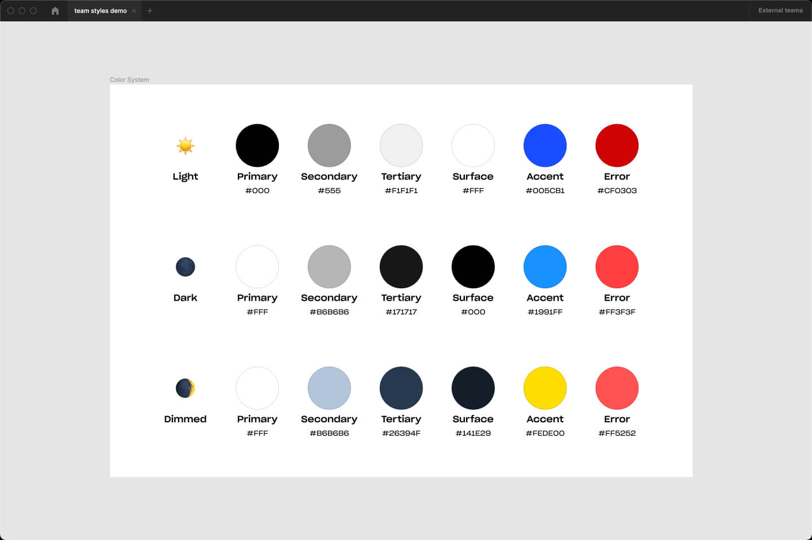

# Dark Vader

## How it works?

1. **Setup your colour system.**
Make sure you have them published

2. **Create a new file and import your colours.**
Nothing complex, just boxes that use your styles

https://user-images.githubusercontent.com/3534296/137645587-a38d0e90-c14e-4827-a8ca-0769e3be685b.mp4

3. **Select layers and use "👩‍💻 Setup" from Dark Vader menu.**
Colour names and IDs will appear. Copy the colour IDs into Airtable [template]
[Template link](https://airtable.com/shrJ5fqeb5a3Nq3H6)

https://user-images.githubusercontent.com/3534296/137645609-68e65eca-47ca-4be4-bc6c-843d96404acb.mp4

4. **After setting up AirTable copy the table link and paste it into "🖤 convert".**
Enjoy using Dark Vader. Just keep that link or bookmark it somewhere

https://user-images.githubusercontent.com/3534296/137645612-387f0557-d8f3-43cd-bdba-bb05309ab1a2.mp4

## Give feedback or report an issue

1. Describe what happened in details.
2. Provide a link to your AirTable sheet.
3. Add a screenshot of the console error. Go to `Plugins > Development > Open console`

Create an issue here: [new issue](https://github.com/zeroxme/dark-vader-issues/issues/new)

---

### Dark Vader is a free plugin for the community. 

[☕️ Support me](https://bit.ly/3aNgF4Q)

Follow me on twitter [@zerox_me](https://twitter.com/zerox_me)

Checkout [my website](https://zerox.me/)
